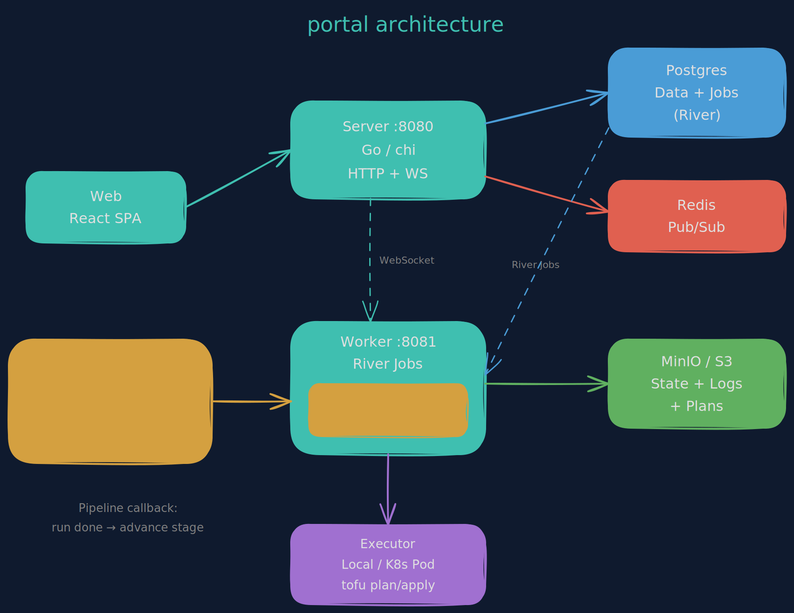

# Architecture

Portal runs as three processes backed by three data stores.



The diagram covers the core tofu lifecycle — the server/worker/web split and the data stores. The cluster operations layer (the vend loop, deprovision watch, ops feed, per-cluster health) lives in the prose below.

## Processes

### Server (`:8080`)

Go HTTP API built with [chi](https://github.com/go-chi/chi). Handles authentication, CRUD operations, WebSocket log streaming, and webhook ingestion.

- **Auth**: GitHub OAuth flow issues a JWT. The login handoff delivers it via a short-lived `auth_token` cookie (never a query parameter); the SPA callback reads the cookie once, deletes it, and keeps the token in localStorage. Every API request carries it as a `Bearer` token. RBAC is enforced via middleware with four roles: `owner > admin > operator > viewer`.
- **Routing**: all routes are defined in `internal/server/server.go` in a single `setupRouter()` function.
- **Handlers**: one file per domain in `internal/handler/` — workspace, run, pipeline, variables, org_variables, pipeline_variables, teams, state, audit, etc. Handlers are transport-only: they call services, services call the repository layer, and serialization happens once at the handler through explicit response DTOs.
- **WebSocket**: run log streaming uses a WebSocket endpoint (`/runs/{runID}/logs/ws`). The client authenticates with the `["bearer", <jwt>]` subprotocol (`Sec-WebSocket-Protocol`); the server validates it, echoes `bearer` on the upgrade, subscribes to the log streamer (Redis or in-memory), and pushes lines to the connected browser.
- **Probes**: `:8080/healthz` (process-only liveness) and `:8080/readyz` (readiness, pings Postgres); `GET /api/v1/health` is the app-level health surface the UI reads.

### Worker (`:8081`)

[River](https://riverqueue.com/) job processor. Postgres is the job queue — no separate broker needed.

- Picks up `run` and `pipeline_stage` jobs enqueued by the server
- Fetches workspace config, variables (merged from org + pipeline + workspace scopes), and previous state
- Delegates to an **executor** (local or Kubernetes)
- Uploads results (state, logs, JSON plan) to S3
- Handles post-plan branching: auto-apply, awaiting approval, or planned
- **Pipeline callback**: when a run completes, checks if it belongs to a pipeline stage and advances the pipeline
- Exposes `:8081/healthz` (process-only liveness) and `:8081/readyz` (readiness, pings Postgres) for probes
- Graceful shutdown: waits for in-progress jobs up to `SHUTDOWN_TIMEOUT`

### Web (`:5173`)

React 19 SPA served by Vite in development and nginx in production.

- **API client**: `openapi-fetch` with typed paths from `web/src/api/types.ts`, generated from `api/openapi.yaml`
- **State management**: TanStack Query for server state, Zustand for local UI state
- **Routing**: TanStack Router with an auth-gated layout route in `router.tsx`
- **Terminal**: xterm.js renders real-time run logs via WebSocket
- **Styling**: Tailwind CSS 4, neutral dark palette with teal primary (see web/src/index.css)

## Data Stores

### Postgres

Primary data store and job queue. All application data lives here — workspaces, runs, pipelines, variables (org/pipeline/workspace scopes), teams, users, audit logs. River uses Postgres advisory locks and a jobs table for reliable queue semantics.

Every query is scoped by `org_id` for multi-tenant isolation.

### Redis

Pub/sub channel for real-time log streaming. When the worker produces log lines, it publishes them to a Redis channel keyed by run ID. The server subscribes and forwards to WebSocket clients.

Falls back to an in-memory fan-out if Redis is unavailable — fine for single-server dev, but logs won't stream across multiple server replicas without Redis.

### Object store (S3)

The object store is external — the chart doesn't bundle one. The S3 client (`internal/storage/s3.go`) runs on `aws-sdk-go-v2` and stores:
- **State files**: `state/{workspaceID}/{serial}.tfstate`
- **Run logs**: `logs/{runID}/{phase}.log`
- **JSON plans**: `plans/{runID}/plan.json`
- **Config archives**: `configs/{workspaceID}/{versionID}.tar.gz` (upload workspaces)
- **Module bundles** for the Kubernetes executor

Credentials follow one of two paths:
- **IRSA / default chain** — leave `S3_ACCESS_KEY` / `S3_SECRET_KEY` empty and the SDK's default credential chain supplies them (env → EKS IRSA web-identity → EC2/ECS). This is the hub path: the worker's IRSA role grants S3 access and no long-lived key sits at rest.
- **Static keys** — set the keys for dev (minio/SeaweedFS) or any S3-compatible store, with a custom `S3_ENDPOINT`. Path-style addressing works against both self-hosted stores and AWS S3, so portal never depends on per-bucket virtual-host DNS.

Config lives in the `objectStore` Helm block / the `S3_*` env. Any S3-compatible store works (AWS S3, MinIO, SeaweedFS, etc).

## Executor Model

The executor interface (`internal/worker/executor/executor.go`) abstracts how tofu commands are run.

### Local Executor

Runs `tofu` directly on the worker's host machine. Good for development and small deployments.

1. Creates a temp directory
2. Clones the git repo (VCS) or extracts the uploaded archive (upload)
3. Restores previous state if available
4. Runs `tofu init` → `tofu validate` → `tofu plan/apply/destroy`
5. Captures output, state file, and JSON plan
6. Cleans up the temp directory

### Kubernetes Executor

Runs `tofu` in ephemeral pods. Used in production for isolation and resource control.

1. Builds a shell script with the full tofu workflow
2. Creates a ConfigMap with the script, variables, and state
3. Creates a Pod that mounts the ConfigMap and runs the script
4. Streams pod logs back to the worker via the K8s API
5. Extracts state and plan JSON from stdout markers
6. Cleans up the Pod and ConfigMap

Per-workspace tofu versions are supported: the pod image is resolved from `EXECUTOR_IMAGE_PREFIX` + the workspace's configured tofu version.

## Run Lifecycle

```
pending → planning → planned ──────────────────────────> (done)
                         ├── auto_apply=true ──> queued → applying → applied
                         └── requires_approval ──> awaiting_approval
                                                     ├── approved → queued → applying → applied
                                                     └── rejected → (done, workspace unlocked)

Any active state → cancelled (via atomic conditional UPDATE)
Any failure      → errored
```

Key behaviors:
- A workspace can only have one active run. Others queue as `pending`.
- When a run finishes, the worker automatically dequeues the next pending run.
- Cancel uses a conditional `UPDATE ... WHERE status IN (cancellable)` — no TOCTOU race.
- Approval uses `SELECT FOR UPDATE` in a transaction to prevent race conditions.

## Pipeline Orchestration

Pipelines create regular workspace runs in sequence. The pipeline is an orchestrator, not an executor.

```
PipelineStageJobWorker          RunJobWorker
        │                             │
        ├── import outputs from       │
        │   previous stage            │
        ├── create workspace run ─────┤
        │   via RunService.Create()   ├── execute tofu
        │                             ├── upload state/logs
        └── (exit, short-lived)       ├── advancePipelineIfNeeded()
                                      │     ├── applied → enqueue next stage
                                      │     ├── errored → check on_failure
                                      │     ├── awaiting_approval → pause
                                      │     └── not a pipeline run → no-op
                                      └── (done)
```

See [pipelines.md](pipelines.md) for usage details.

## Variable Inheritance

Variables are loaded and merged at run time in the worker:

```
org_variables        ──┐
                       ├── mergeVariables() ──> executor
pipeline_variables   ──┤
                       │   key|category wins:
workspace_variables  ──┘   workspace > pipeline > org
```

Tag variables (`tags`, `default_tags`, `*_tags`) are deep-merged as JSON maps instead of replaced. This allows org-wide tags (team, cost_center) to combine with workspace-specific tags (app, component).

See [variables.md](variables.md) for details.

## Team Cloud Identities

Team members have an optional `cloud_identity` field for mapping portal users to AWS principals (IAM role ARNs).

This is a data field on the team member record — portal stores it but doesn't automatically inject it into runs. Use it as reference when building access entry variables for your cluster workspaces.

## VCS Webhook Flow

1. GitHub sends a `push` event to `POST /api/v1/webhooks/github`
2. Server verifies the HMAC-SHA256 signature using `WEBHOOK_SECRET`
3. Parses the repo URL and branch from the payload
4. Finds matching workspaces (normalized repo URL, same branch, `vcs_trigger_enabled=true`, not locked)
5. Enqueues a plan run for each matching workspace

## Cluster Operations Layer

On top of the tofu lifecycle, portal runs the cluster substrate as an operations daily-driver: vend a cluster, watch it build, tear it down, and read its health — all from the same UI. The write path mirrors the tenant write path (form → GitOps commit → ArgoCD), and the read side is a set of in-cluster watchers that project live substrate state onto DB rows. The UI reads the projection; the cluster always wins.

### Vend Loop

Ordering a cluster runs the order desk → Cluster CR → ArgoCD → Crossplane → watch-back chain:

```
ClusterOrderService.EnqueueProvision   (order desk)
        │  validate spec, write cluster_operations row (pending)
        │  enqueue ClusterApplyJob
        ▼
ClusterApplyJobWorker                   (worker)
        │  render eks-fleet Cluster CR from spec_json
        │  commit + push to the clusters GitOps repo
        │  row → committed (or failed, with the error)
        ▼
ArgoCD (hub)  → applies the Cluster CR
Crossplane    → composes provider-opentofu Workspaces (<name>-stack, <name>-bootstrap)
        ▼
ClusterProvisionWatchService.Sync       (in-cluster watch-back, every CLUSTER_WATCHBACK_INTERVAL)
        │  read the Cluster XR + its Workspaces on the hub
        │  project the vend timeline phase onto vend_phases
        │  once endpoint + CA + name are up AND the XR is Ready:
        │    auto-register a portal cluster (eks_iam, no stored token)
        │    kick a connection test → cluster flows into tenant-watch
        └  row → active
```

The vend timeline is `queued → committed → building → active`. The order desk writes the portal-side checkpoints (`committed` / `failed`); the watch-back writes the substrate phases. `building` carries the live tofu phase — the watch-back reads the provider-opentofu Workspaces' `.status.conditions[]` and surfaces the current tofu error as the phase detail. That detail is **regressible**: it's re-written each tick, so a transient `ReconcileError` clears when the Workspace recovers and a genuine one persists. The watch-back never brands a vend permanently failed off a tofu error snapshot (provider-opentofu retries) — the only terminal `failed` is a portal-side commit failure.

`vend_phases` is a best-effort projection merged one key at a time (`vend_phases || fragment`), so a projection-write hiccup never fails a job whose operation actually completed. The `cluster_operations` status row is the verdict; the timeline is the narration.

The watch-back is modeled on a periodic in-cluster sync rather than a River job — the `cluster_operations` rows carry all durable state, so each tick is a stateless reconcile over the committed working set. Auto-registration lands the cluster as `eks_iam` (no stored service-account token); on a real hub the worker mints EKS tokens by assuming the per-account `portal-spoke` role.

### Deprovision Watch

Tearing a cluster down is the same path in reverse. `EnqueueDeprovision` records intent, the apply worker removes the manifest from the clusters repo, ArgoCD prunes the Cluster CR, and Crossplane runs `tofu destroy` on the composed Workspaces. The same `ClusterProvisionWatchService` watches committed deprovision ops: while the Cluster XR still exists, teardown is in flight, so it projects a regressible `deprovisioning` phase carrying any tofu-destroy error. The XR going NotFound on the hub **is** the completion signal — only when the Workspaces are gone does the XR disappear, at which point the op flips to `deprovisioned`.

### Ops Feed

`OpsFeedService` assembles the org-wide operations feed — cluster vends and tenant deploys merged into one recency-sorted activity stream. It's a pure read-model view over the two operation logs (`cluster_operations`, `tenant_operations`); it never writes. Cluster ops carry the rich vend timeline; tenant ops terminate at commit and ride as their status. Each entry sorts on its activity time — completion time if finished, else placement time — so a just-finished op floats up alongside fresh orders.

### Per-Cluster Health

`ClusterHealthService` is the steady-state health projector — distinct from the vend watch-back, which stops once a cluster goes active. Running in-cluster on the hub, every `CLUSTER_HEALTH_INTERVAL` it reads, for each registered cluster:

- **ArgoCD sync + health** — the per-cluster ArgoCD Application on the hub (`cluster-<environment>-<name>`, the name the eks-gitops clusters appset templates). It reads the **hub**, never the spoke, so a cluster portal can't connect to still reports ArgoCD health. A NotFound is definitive (clears the fields); a transient read error preserves the last-known values.
- **EKS control plane** — for `eks_iam` clusters, `eks:DescribeCluster` via the per-account `portal-spoke` role, surfacing the control-plane lifecycle (ACTIVE/UPDATING/...) and the EKS platform version. Until that IAM is granted the call returns AccessDenied, treated as "unknown" — logged and the prior values preserved, so the rest of the projection still works.

Both land on the cluster row (mirroring the connection-test projection), so the cluster surface shows live health without a probe in the request path. The UI renders them as an ArgoCD badge and a control-plane badge per cluster.

### Hub Identity

On a real EKS hub, portal's cross-account IAM is codified in landing-zone: a `portal-hub` worker IRSA role and a per-account `portal-spoke` read role. The worker's base identity comes from the IRSA role (the SDK default chain), and `AssumeRoleConfig` produces a config that authenticates as the spoke — that's what mints EKS tokens and runs `eks:DescribeCluster`. The same IRSA identity backs the object store, so no static keys sit at rest. See the `deploy-on-hub.md` runbook for the wiring.

## Multi-Tenant Isolation

Every database query includes an `org_id` filter. The org ID comes from the authenticated user's JWT claims. There is no way to query across organizations through the API.
